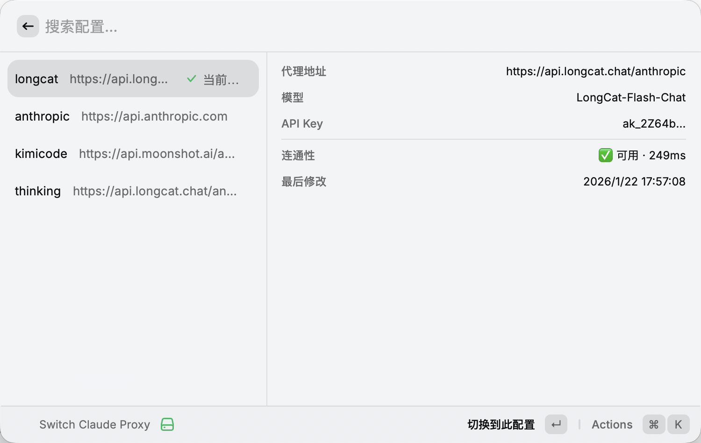

# 🔀 Claude Proxy Switcher

Visually manage and switch between multiple Claude Code proxy configurations with one keystroke.

可视化管理多个 Claude Code 代理配置，一键完成切换。

---

## 🤔 Why / 为什么需要这个工具

Claude Code supports third-party proxies via `~/.claude/settings.json`. If you use multiple providers (e.g. Kimi, LongCat, official Anthropic), you previously had to edit this file manually or maintain a shell script.

Claude Code 通过 `~/.claude/settings.json` 支持第三方代理。如果你同时使用多家代理（如 Kimi、LongCat、Anthropic 官方），以前只能手动编辑文件或维护 Shell 脚本。

This extension gives you a clean GUI to create, switch, and manage all your proxy profiles.

这个扩展为你提供了一个干净的 GUI，用于创建、切换和管理所有代理配置。




---

## ✨ Features / 功能

- ⚡ **One-key switching** — switch the active proxy in under a second

  **一键切换** — 不到一秒完成代理切换

- 🗂️ **Profile management** — create, edit, rename, and delete proxy configurations

  **配置管理** — 新建、编辑、重命名、删除代理配置

- 🌐 **Connectivity test** — verify a proxy is reachable before switching (no token consumed)

  **连通性测试** — 切换前验证代理是否可用（不消耗 token）

- 🤖 **Quick model update** — change the model without re-entering your API key

  **快速换模型** — 无需重新填写 API Key，直接更新模型

- 📤 **Import / Export** — share profiles with teammates; API keys are masked on export

  **导入 / 导出** — 与他人共享配置；导出时 API Key 自动脱敏

- 🛡️ **Auto backup** — profiles are backed up to `~/.claude/backups/` before any destructive operation

  **自动备份** — 删除或修改前自动备份到 `~/.claude/backups/`

- 🧙 **Init wizard** — first-time setup converts your existing `settings.json` into the multi-profile system automatically

  **初始化向导** — 首次使用时自动将现有 `settings.json` 转换为多配置体系

---

## ⚙️ How It Works / 工作原理

Each profile is stored as `~/.claude/settings-{name}.json`. Switching profiles updates `~/.claude/settings.json` to be a symlink pointing to the chosen profile file. Claude Code picks up the change immediately — no restart required.

每个配置保存为 `~/.claude/settings-{name}.json`。切换时将 `~/.claude/settings.json` 更新为指向目标配置文件的符号链接。Claude Code 立即生效，无需重启。

---

## 🚀 Getting Started / 快速开始

1. 📥 Open Raycast and search for **Switch Claude Proxy**

   打开 Raycast，搜索 **Switch Claude Proxy**

2. 🧙 If you already have a `~/.claude/settings.json`, the init wizard will appear — give your current config a name (e.g. `default`) and confirm

   如果已有 `~/.claude/settings.json`，会出现初始化向导——为现有配置命名（如 `default`）后确认

3. ➕ Press **⌘+N** to add more proxy profiles

   按 **⌘+N** 新增更多代理配置

4. ↩️ Press **Enter** on any profile to switch to it

   在任意配置上按 **Enter** 即可切换

---

## ⌨️ Keyboard Shortcuts / 快捷键

| Shortcut | Action                             | 说明                     |
| -------- | ---------------------------------- | ------------------------ |
| `Enter`  | ⚡ Switch to selected profile      | 切换到选中配置           |
| `⌘ T`    | 🌐 Test connectivity               | 测试连通性               |
| `⌘ N`    | ➕ New profile                     | 新建配置                 |
| `⌘ E`    | ✏️ Edit profile                    | 编辑配置                 |
| `⌘ M`    | 🤖 Change model only               | 仅修改模型               |
| `⌘ D`    | 🗑️ Delete profile                  | 删除配置                 |
| `⌘ ⇧ E`  | 📤 Export profile (API key masked) | 导出配置（API Key 脱敏） |
| `⌘ ⇧ I`  | 📥 Import profile from JSON        | 从 JSON 导入配置         |
| `⌘ R`    | 🔄 Refresh list                    | 刷新列表                 |

---

## 📋 Requirements / 环境要求

- 🖥️ [Claude Code](https://claude.ai/code) installed (`~/.claude/` directory must exist)

  已安装 Claude Code（`~/.claude/` 目录必须存在）
- 🍎 macOS 12 or later / macOS 12 及以上

---

## 🛠️ Development / 本地开发

**Prerequisites / 前置条件**

- [Raycast](https://raycast.com) installed / 已安装 Raycast
- Node.js 18+ / Node.js 18 及以上
- [Claude Code](https://claude.ai/code) installed / 已安装 Claude Code

**Clone and run / 克隆并运行**

```bash
git clone https://github.com/EtherealMingo/switch_claude.git
cd switch_claude
npm install
npm run dev
```

`npm run dev` starts a file watcher and hot-reloads the extension inside Raycast automatically. Open Raycast and search for **Switch Claude Proxy** to see it live.

`npm run dev` 启动文件监听，修改代码后 Raycast 自动热重载，无需手动刷新。打开 Raycast 搜索 **Switch Claude Proxy** 即可实时查看效果。

**Build / 构建**

```bash
npm run build   # output to dist/
```

**Project structure / 项目结构**

```
src/
├── switch-claude.tsx      # Main command / 主命令入口
├── types.ts               # TypeScript type definitions / 类型定义
├── constants.ts           # Path constants & provider templates / 路径常量和代理模板
└── utils/
    ├── config.ts          # Profile scanning & active detection / 扫描配置文件
    ├── switch.ts          # Symlink switching / 符号链接切换
    ├── file.ts            # Atomic CRUD & backup / 原子写入、增删改、备份
    ├── validate.ts        # Name & URL validation / 名称和 URL 校验
    ├── connectivity.ts    # Connectivity test / 连通性测试
    └── transfer.ts        # Import & export / 导入导出
```

---

## 🔒 Privacy / 隐私说明

All data stays local. API keys are stored in `~/.claude/settings-{name}.json` on your own machine. Nothing is sent anywhere except when you explicitly test connectivity (a single GET request to your configured proxy's `/v1/models` endpoint).

所有数据均保存在本地。API Key 存储于你自己机器上的 `~/.claude/settings-{name}.json`。除主动测试连通性时会向你配置的代理地址发送一次 GET 请求外，不会向任何地方发送数据。
